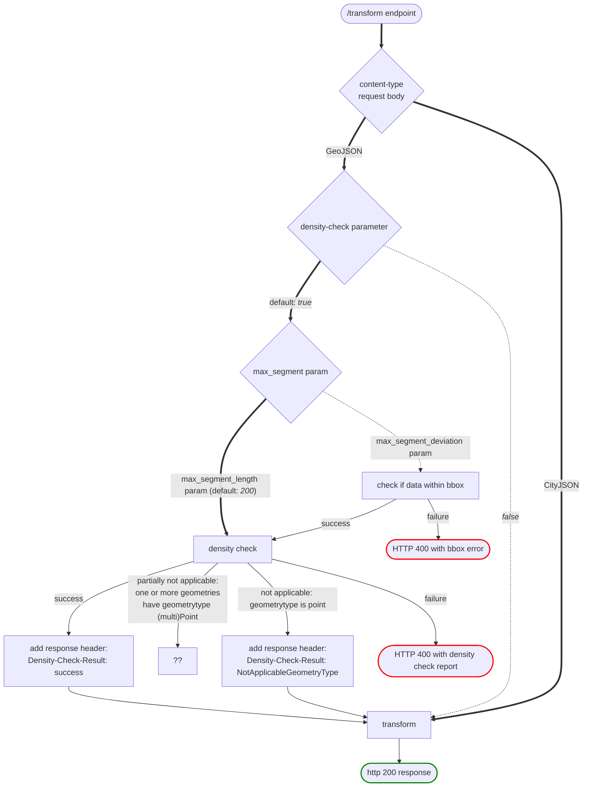

# Coordinates transformation API

RESTful coordinates transformation API offering NSGI approved transformations
for the Netherlands. Build on top of pyproj and FastAPI.

## Assumptions

- API metadata, documentation and source code is in English
- Easily accessible, but correct
- Conforms (as much is possible) to the [OGC API
  Common](https://ogcapi.ogc.org/common/) and the [NL API Design
  rules](https://gitdocumentatie.logius.nl/publicatie/api/adr/)

## pyproj

> :warning: pyproj makes use of it's own proj binaries and `PROJ_DIR`. These are
> set when pyproj is build.

Pyproj with default configuration is not capable in performing the right
transformations, because our primary transformations layer on the following
transformation grids:

Variant 1:

1. <https://cdn.proj.org/nl_nsgi_nlgeo2018.tif>
1. <https://cdn.proj.org/nl_nsgi_rdcorr2018.tif>

The recommended variant.

Variant 2:

1. <https://cdn.proj.org/nl_nsgi_rdtrans2018.tif>

These transformation grids need to be downloaded from the [PROJ.org Datumgrid
CDN](https://cdn.proj.org/) and put in the correct directory. This can be done
in a couple of ways.

1. Enable PROJ_NETWORK environment variable
1. Edit proj.ini file by setting `network = on`

These will download the necessary files to a cache so they can be use for the
correct transformation. But this requires a network connection, preferable we
don't want to rely on this network connection and provide these files with the
application. This can be done by

1. [Mirror](https://pyproj4.github.io/pyproj/stable/transformation_grids.html)
   <https://dcn.proj.org> and write the these file to the data directory
1. Download the specific files to the root of the data directory

## Development

To install from source requires minimum version of pip: `23.2.1`.

Install dev dependencies with:

```sh
pip install ".[dev]"
```

Install enable pre-commit hook with:

```sh
git config --local core.hooksPath .githooks
```

To run debug session in VS Code install the package with `pip` with the
`--editable` flag:

```sh
pip install --editable .
```

Also install mypy as follows

```sh
mypy --install-types
```

Check test coverage (install `coverage` with `pip install coverage`):

```sh
coverage run --source=src/coordinates_transformation_api -m pytest -v tests && coverage report -m
```

## Install

```bash
pip install .
```

## Run

```bash
ct-api
```

## Docker

### Build container

```bash
docker build -t nsgi/coordinatestransformation-api .
```

### Run container

```bash
docker run --rm -d -p 8000:8000 --name ct-api nsgi/coordinatestransformation-api
```

## CityJSON

### Generate CityJSON models

```sh
wget --no-parent  --recursive https://3d.bk.tudelft.nl/schemas/cityjson/1.1.3/
pip install datamodel-code-generator
datamodel-codegen  --input  3d.bk.tudelft.nl/schemas/cityjson/1.1.3/metadata.schema.json  --input-file-type jsonschema --output cityjson.py
```

### Working with CityJSON (with cjio cli)

Download test/sample data from
[www.cityjson.org/datasets/](https://www.cityjson.org/datasets/).

Creating a subset of CityJSON file (for - for example - testing purposes):

```sh
cjio DenHaag_01.city.json subset --random 10 save test_10.city.json
```

CRS transformation with `cjio`:

```sh
cjio test_1.city.json crs_reproject 4937 save test_1_4937.city.json
```


